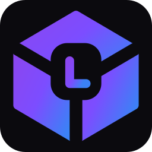
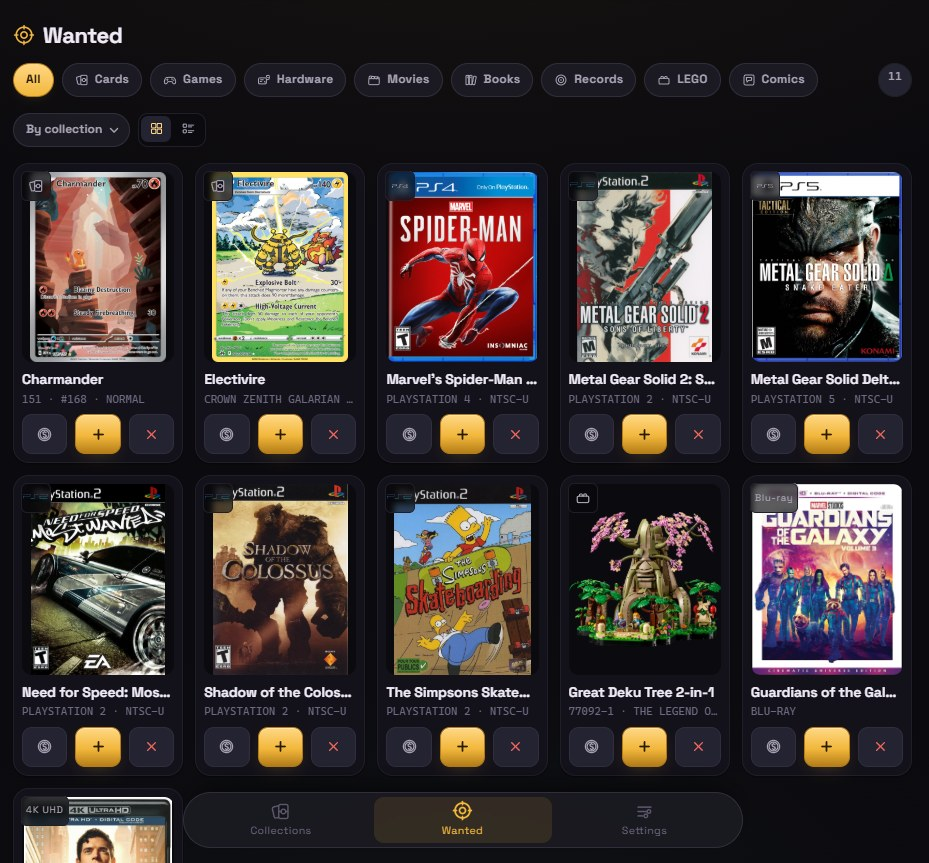
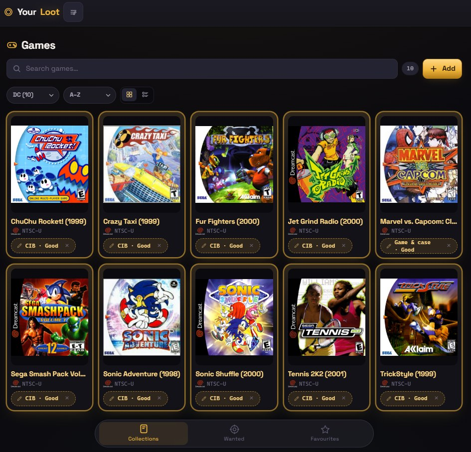
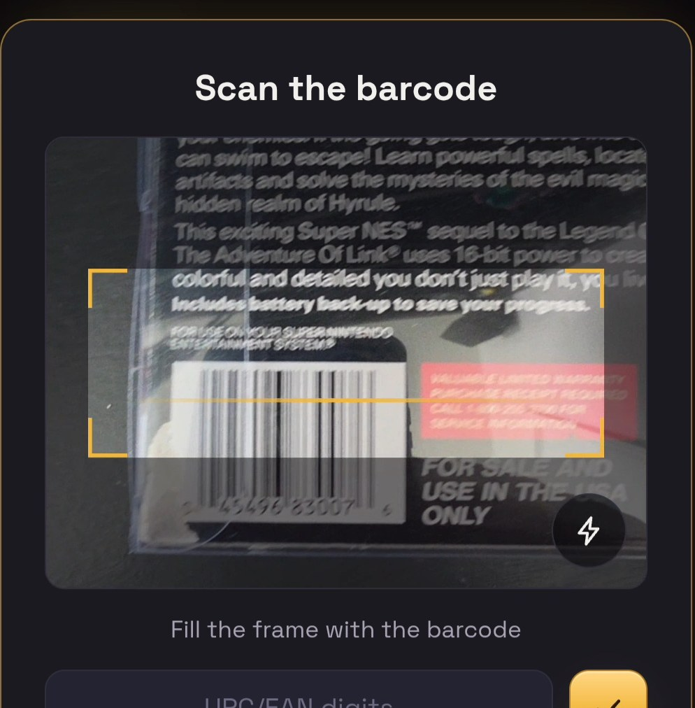
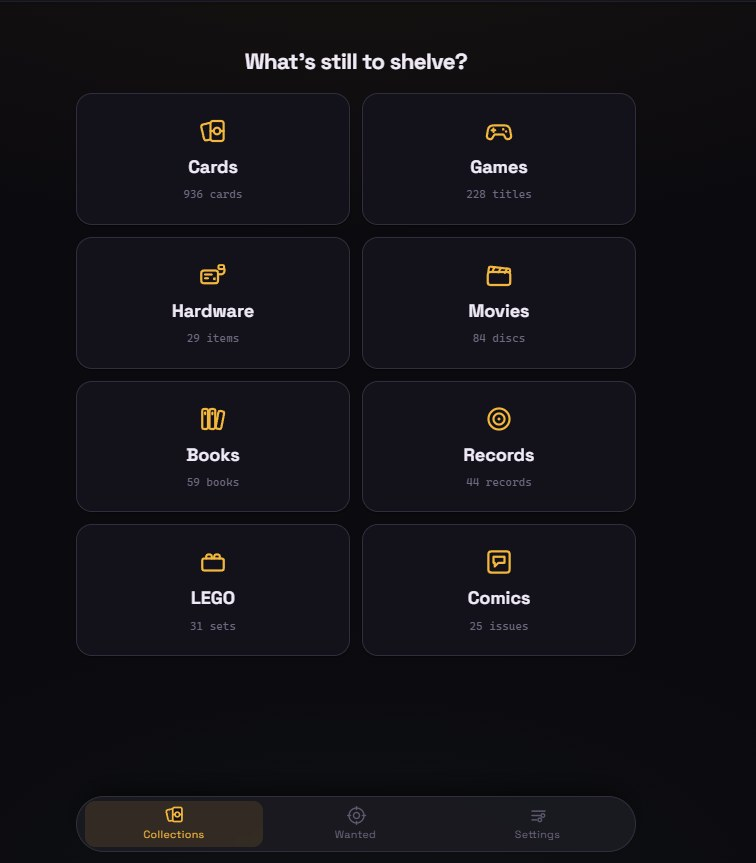
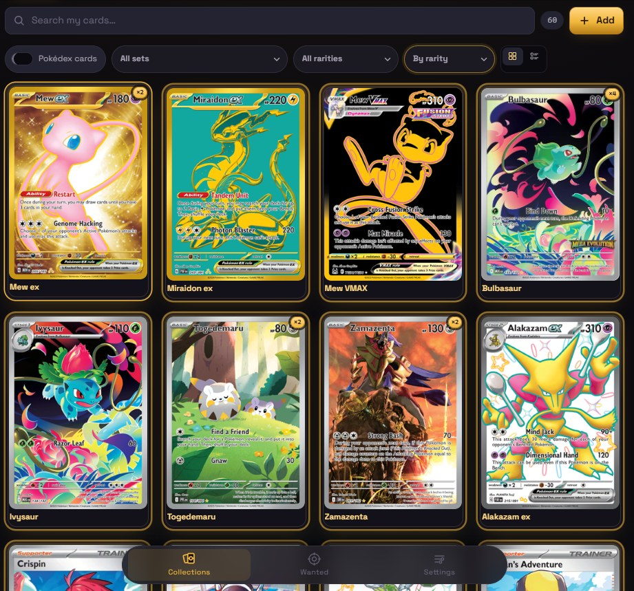
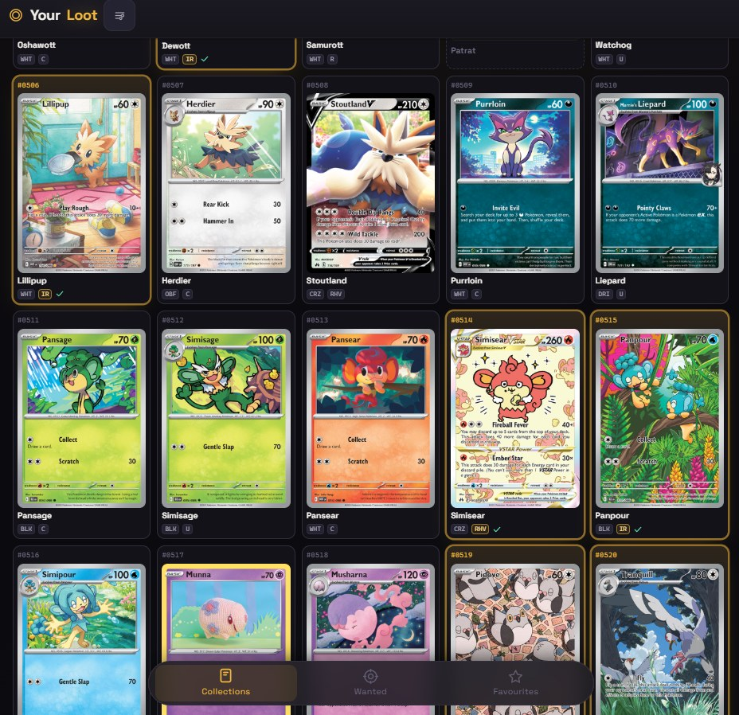

<p align="center">
  
</p>

<h1 align="center">Your Loot</h1>

<p align="center">
  <a href="https://github.com/Bokicksit/Your-Loot/releases"></a>
  <a href="LICENSE"></a>
  <a href="https://github.com/Bokicksit/Your-Loot/actions/workflows/build-push.yaml"></a>
  
</p>

Self-hosted collection tracker for **Pokémon cards, amiibo, video games,
hardware, physical movies, books, records, LEGO, and comics** — one app, one
database, one wanted list that spans all of them.

Most trackers do a single category. This one is built for people whose shelf
isn't that tidy: the Charizard you're hunting and the SNES console you're
hunting live on the same list.

<p align="center">
  
  
  
</p>

<p align="center">
  <em>One wanted list across everything · your shelf as its own covers · and a
  barcode fills the rest in</em>
</p>

> [!IMPORTANT]
> **Out of the box there is no login screen** — it opens straight into your
> collection, which is what you want on a home network. Two ways to change
> that: set a password or PIN in **Settings → Lock this app**, or turn on
> `AUTH_MODE=multi` for real accounts.
>
> Either way, **still don't put it on the open internet.** A lock on the app
> is not the same as hardening a server. Use a VPN or an authenticating
> reverse proxy — see [SECURITY.md](SECURITY.md).

<p align="center">
  
</p>

📖 **[User Guide](docs/USER-GUIDE.md)** — how everything works, in depth:
adding items, barcode scanning, the binder, grading, backups, troubleshooting.

## What it does

**Cards** — search 20,000+ Pokémon cards by name, number, or set code (`151`,
`MEW`, `JTG`). Track each copy with condition and grading (PSA/BGS/CGC…). Cards
missing from the offline database can be pulled from an online catalog or
entered by hand with your own photo. A further 13,000 Japanese cards are
available as an optional second catalogue — see
[Keeping it running](#keeping-it-running).

**Pokédex binder** — a slot per national dex number, mirroring a physical
binder: one card per Pokémon, marked either *the one* or *will upgrade*.
Filter by what's missing, what wants upgrading, and by rarity.

**Binders** — as many as you keep, in two more kinds. A **set binder** is a
whole set with a slot per card, drawn from the offline catalogue: no importing,
and no filing either, because owning the card fills its slot. It shows the art
of the ones you don't own too, so a gap looks like the card it wants. A
**binder of your own** holds whatever you choose, in the order you choose —
nothing but Charizards, or the ones you'll trade — arranged by picking a card
up and tapping where it goes. Each one takes a cover, and one card can be in
several binders at once: your best Charizard belongs in the Pokédex, in the
Celebrations binder and in the Charizard binder, all at the same time.

<p align="center">
  
  
</p>

**Games** — IGDB-backed search, platform/region, and per-copy completeness
(loose/CIB/sealed) and condition. Barcode scanning for boxed games. For
consoles up to the Xbox 360 era it also offers a **scan of the actual box**
from libretro-thumbnails — no key needed — instead of IGDB's key art, which
looks the same whether you own the original or a download.

**Hardware** — consoles and accessories with model number, serial, working
status, and accessory→console links.

**Movies** — TMDB-backed, with the physical details that matter: format
(4K/Blu-ray/DVD/VHS), edition, region code. Scanning the barcode also pulls
photographs of the actual case, so a steelbook looks like your steelbook
instead of the theatrical poster.

**Books** — Open Library search, or scan the ISBN barcode on the back. Format,
edition, series, and per-copy jacket/provenance. Graphic novels, collected
editions and manga live here rather than in Comics — they carry an ISBN, and
filtering to *Graphic Novel* sorted by series gives you that shelf in reading
order.

**amiibo** — the whole line seeded as a catalogue, the way cards are: all
932 figures, cards, yarns and bands from the open amiibo database, each under
the head-and-tail id Nintendo burned into the figure itself. Adding one is
searching and picking it — no key, no external API, nothing to run out of —
and your copy records what matters at a glance: new in box, boxed, or loose.

```bash
docker compose exec api python /seed/seed_amiibo.py
```

**Records** — MusicBrainz search, or scan the barcode on the sleeve, which
identifies the *pressing*: label, catalogue number, country, and year, so a
1980 original and a 2011 repress stay separate entries. Graded the way vinyl
actually is — media and sleeve independently, on the Goldmine scale (`VG+/VG`).

**LEGO** — Rebrickable-backed set search by number or name, with theme, year,
piece and minifig counts. Each copy answers two questions rather than one:
whether you kept the box, and what state the set is in — sealed, opened and
complete, loose bricks, built, or missing pieces. Sealed implies the box, and
the form won't let you say otherwise.

**Comics** — Comic Vine search by series and issue. Tracks the run
(`volume_year`) and the variant cover, because Amazing Spider-Man #1 exists in
half a dozen volumes. A raw copy carries a grade; a slabbed one carries its
CGC/CBCS number instead. Single issues — collected editions are books.

**Sold prices** — every item, owned or wanted, has a coin in its details panel
that opens an eBay search filtered to *sold and completed* listings. The query
is built from whatever separates two listings in that collection: the set and
number for a card, the model number for a console, the pressing format for a
record.

**Wanted list** — everything you're hunting, across every module, with
filters and the same sold-price shortcut. Mark something acquired and
it moves into your collection with the condition you set. Find only the case or
the manual and it records the spare while the game stays on the hunt.

**Accounts, if you want them** — nothing by default: the app opens straight
into your collection. Set a password or a short PIN in Settings and it asks
first, the way Radarr and Sonarr do. Or run with `AUTH_MODE=multi` for proper
accounts, where everyone gets their own copies, wanted list, binder and
Pokédex off one shared catalog. Passwords are argon2id, sessions are signed
http-only cookies, and repeated wrong guesses are throttled.

**Share a collection** — any shelf, the wanted list, or the binder, as a single
HTML file with the cover art packed inside it. Send it like a photo: it opens in
any browser, needs nothing installed, and works with no signal. It's an export
rather than a link, so nothing on your network has to be reachable from outside,
and it carries a plain list — cover, title, condition. Your notes, tags, serial
numbers and grading certificates stay here.

**Backup & restore** — two of them, because they answer different questions.
**Your collection** is yours: every item, every copy with its condition, the
wanted list, your binders and your photos, in a file that restores into your
account on any Your Loot install. **Whole server** is the operator's copy of
the machine, and it loads only into an install with nothing in it yet — a
rebuilt box, a fresh database. Nothing that is already on a server can be
replaced by a restore, by anybody. Both are plain JSON inside, so they stay
readable and portable across Postgres versions.

## Quick start

```bash
git clone https://github.com/Bokicksit/Your-Loot.git && cd Your-Loot
cp .env.example .env      # set POSTGRES_PASSWORD
docker compose up -d
```

Open **http://localhost:8080**. It asks your name, then you're in.

The card database (~20k cards) downloads itself in the background on first
start — the app is usable immediately and cards appear within a few minutes.
Watch it if you like:

```bash
docker compose logs -f api
```

### Optional API keys

All free, all optional. Without one, that collection's online search says which
key is missing and manual entry still works. Cards, books and records need no
key at all.

| Key | For | Where |
| --- | --- | --- |
| `IGDB_CLIENT_ID` / `IGDB_CLIENT_SECRET` | game search | [Twitch dev console](https://api-docs.igdb.com/#account-creation) |
| `TMDB_API_KEY` | movie search | [themoviedb.org](https://www.themoviedb.org/settings/api) |
| `REBRICKABLE_API_KEY` | LEGO set search | [rebrickable.com](https://rebrickable.com/users/_/settings/#api) → Account → Settings → API |
| `COMICVINE_API_KEY` | comic search | [comicvine.gamespot.com/api](https://comicvine.gamespot.com/api/) |
| `DISCOGS_TOKEN` | record barcodes | [discogs.com/settings/developers](https://www.discogs.com/settings/developers) → Generate token |

There's one more that isn't a key:

| Setting | Default | What it does |
| --- | --- | --- |
| `AUTH_MODE` | `single` | `single` = one collection, and a login only if you set a password in Settings. `multi` = accounts, each with their own collection. |

Add them to `.env` and `docker compose up -d` again.

## Keeping it running

**Update:**
```bash
docker compose pull && docker compose up -d
```
Database migrations run automatically. To update deliberately instead, pin a
version with `TAG=` in `.env` — `TAG=2.32`, taken from the
[releases page](https://github.com/Bokicksit/Your-Loot/releases) **without the
leading `v`**, since the release is named `v2.32` but the image it built is
tagged `2.32`.

**Refresh the card database** (new sets, corrections) — weekly cron is plenty:
```bash
docker compose exec api python /seed/seed_cards.py --download
```
This only ever adds and updates catalog entries. Your owned copies, wanted
list, binder picks, grades, and any photos you added are never touched.

**Japanese cards** are a second catalogue — 13,061 cards across 124 sets,
including the sets that never had an English printing. Off by default, because
it doubles the size of the card database and most collections never need it.
Turn it on with `SEED_JAPANESE=true` in `.env` and restart, or do it once by
hand:
```bash
docker compose exec api python /seed/seed_cards_ja.py --download
```
Either way it takes about 40 seconds, adds roughly 7 MB, and is only ever done
once — the automatic version checks first and skips if they are already there.
Until you run it, nothing about Japanese appears anywhere in the app.

Once seeded: a **JP** button beside the card search brings up Japanese
printings instead of English, and each one shows the English species name
underneath so you can find リザードン by typing Charizard. Japanese cards go in
your collection, your Pokédex and binders of your own — not set binders, since
those sets have no English equivalent to be a set *of*. A binder takes them
only when its settings say so, so the Pokédex you built in English stays that
way until you decide otherwise.

About 6 in 10 have artwork. Modern sets are complete; the 1990s and 2000s sets
and the very newest releases have none yet, and those cards show an empty frame
with the English name in it. That is TCGdex's coverage rather than a setting —
it improves on its own as scans are contributed there. Your own photos work on
Japanese cards exactly as they do on English ones.

To undo it entirely:
```bash
docker compose exec postgres psql -U getloot -d getloot \
  -c "delete from collection_item where source = 'tcgdex-ja';"
```
That takes the Japanese catalogue with it and leaves everything you own alone.

**Public profiles** turn a collection into a page you can send somebody —
`/u/yourname`, showing only the shelves you tick, with thumbnails. Off by
default, and that is the honest setting for the install this ships as: a home
server nobody outside the house can reach has nothing to publish to. Turn it
on with `PUBLIC_PROFILES=true` in `.env`.

It is one switch with two consequences. Where profiles are on they replace the
downloadable share in Settings, because a link is better than a file when
there is a server to answer it; where they are off the file is the only thing
that could ever have worked. Names are claimed once and never changed — the
URL is an address, and an address that moves breaks every link you gave out —
so an administrator can take one away but nobody can swap theirs.

Nothing is public until you tick it, notes and tags and serial numbers are
never included, and a profile with nothing ticked returns "not found" rather
than an empty page.

**Running this for a lot of people?** Card pictures are seeded pointing at
`images.pokemontcg.io`, which belongs to the project publishing the card
database — fine for a household, less fine as somebody else's bandwidth bill.
Move them onto TCGdex's asset host, which is published under MIT for this:
```bash
docker compose exec api python /seed/backfill_art.py --dry-run
docker compose exec api python /seed/backfill_art.py
```
Roughly one card in twenty has no art there — mostly Shiny Vault, the Trainer
Galleries and the Galarian Gallery — and those keep the picture they have.
Photos you took yourself are never touched, the refresh above won't undo it,
and `CARD_ART=tcgdex` in `.env` does it automatically on first start.

**Running it on a platform host** (Railway, Fly, Render) rather than compose?
The web container assumes the API answers to `api` on port 8000, which is true
under compose and nowhere else. Two variables on the **web** service fix it,
and neither is needed for a normal install:
```bash
API_UPSTREAM=<your api service host>:8000
```
`PORT` is also honoured, since most platforms assign one rather than letting
you listen on 80. Point the API service at a managed Postgres with
`DATABASE_URL`, set `PUBLIC_URL` to the address people actually type, and
**pin both images to a version** — `latest` moves whenever this repo does,
which is not what you want under a live site.

**Back up** from **Settings → Whole server** — one zip with every account's
items, copies, wanted entries and photos. Keep it somewhere that isn't this
server. (Each person can also take their own from **Your collection**.) At the
filesystem level the `data/` directory holds the Postgres database and your
uploaded images; nothing else holds state.

**Show off your room** — set `PUBLIC_PROFILES=true` and your collections get
a public page at `/loot`, drawn as a collector's room. The user guide covers
putting just that page on the internet through Cloudflare Tunnel or Tailscale
Funnel, without exposing anything else on your server.

## Remote access

Even with a password set, **don't expose port 8080 to the internet directly.**
The lock keeps a housemate out of your collection; it is not a hardened
front door, and there's no HTTPS unless you put some in front. Either:

- **Tailscale** — reach it privately from your phone, nothing public.
- **Cloudflare Tunnel + Access** — a real HTTPS hostname gated by your email.
  HTTPS also unlocks the barcode scanner, since browsers only allow camera
  access on secure origins.

## Running on TrueNAS SCALE

See [`deploy/compose.truenas.yaml`](deploy/compose.truenas.yaml) — paste it into
**Apps → Discover Apps → ⋮ → Install via YAML**, after editing the password and
dataset paths. It publishes port 30080, since 8080 is usually taken.

**To update it:** *Apps → Installed → Your Loot → Edit*, then **Save**. TrueNAS
pulls the images and recreates the containers — that's the whole update. The
`docker compose pull` in [Keeping it running](#keeping-it-running) is for
plain-Docker installs; a TrueNAS app is managed by TrueNAS, and running compose
against it by hand from a shell means fighting it for control of the stack.

**To check what's actually running**, open `http://<your-nas>:30080/api/health`
in a browser. That's the API's version; the bottom of the Settings page is the
web container's. **If the two disagree, one image updated and the other
didn't** — which looks like the app being broken rather than being half
upgraded, so it's worth checking first whenever something is behaving oddly
after an update.

## Development

```bash
docker compose -f compose.dev.yaml up --build
```
Builds from source instead of pulling images, exposes the API on :8000
(interactive docs at `/docs`), and skips the first-run seed. Frontend-only
work: `cd web && npm install && npm run dev` — that one needs Node 20.19+ or
22+ on your machine, which Vite requires. The Docker build carries its own.

**Stack:** FastAPI + SQLAlchemy + Alembic + Postgres, React + Vite, nginx.
One `collection_item` table shared by every module, with per-module attribute
tables and separate `owned`/`wanted` records — which is why the wanted list can
span every category with a single query. Adding another module is a new
attributes table plus a router; nothing existing changes.

```
api/     FastAPI app, models, migrations, integrations (IGDB/TMDB/TCGdex/…)
web/     React SPA + nginx
seed/    offline card-database seeder
deploy/  TrueNAS compose
```

## Data sources & credits

- Card data: [pokemon-tcg-data](https://github.com/PokemonTCG/pokemon-tcg-data)
  and [TCGdex](https://tcgdex.dev) · Japanese cards and all card artwork:
  [TCGdex](https://tcgdex.dev) (MIT)
- Games: [IGDB](https://www.igdb.com), box scans from
  [libretro-thumbnails](https://github.com/libretro-thumbnails) ·
  Movies: [TMDB](https://www.themoviedb.org)
  (this product uses the TMDB API but is not endorsed or certified by TMDB)
- Books: [Open Library](https://openlibrary.org)
- Records: [MusicBrainz](https://musicbrainz.org) and the
  [Cover Art Archive](https://coverartarchive.org)
- amiibo: the [AmiiboAPI open database](https://github.com/N3evin/AmiiboAPI)
- LEGO: [Rebrickable](https://rebrickable.com) · Comics:
  [Comic Vine](https://comicvine.gamespot.com)
- Barcodes: [UPCitemdb](https://www.upcitemdb.com)
- Console logos: see [`web/public/platforms/ATTRIBUTION.md`](web/public/platforms/ATTRIBUTION.md)

Every integration is optional and free — see
[Optional API keys](#optional-api-keys).

Pokémon and all card imagery are property of Nintendo / Creatures Inc. /
GAME FREAK inc. and The Pokémon Company. This project is a personal collection
tool, unaffiliated with and unendorsed by any of them.

## License

[AGPL-3.0](LICENSE) — free to use, self-host, and modify. If you run a modified
version as a network service, you must publish your changes.
